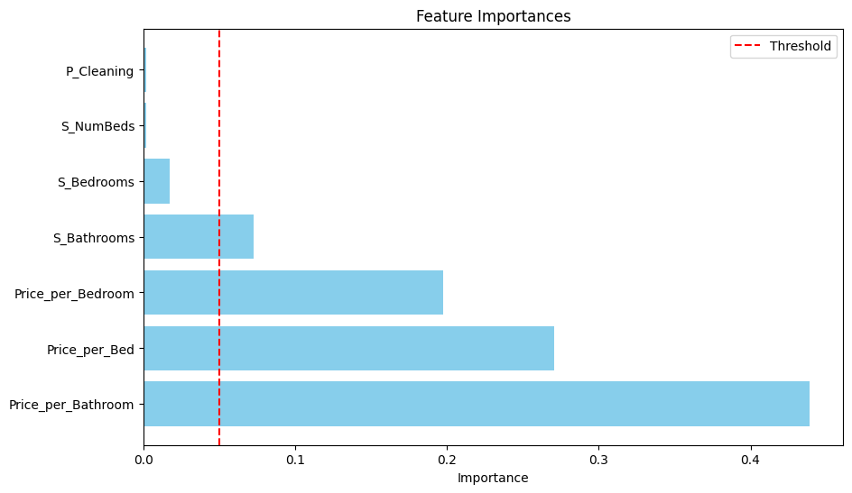
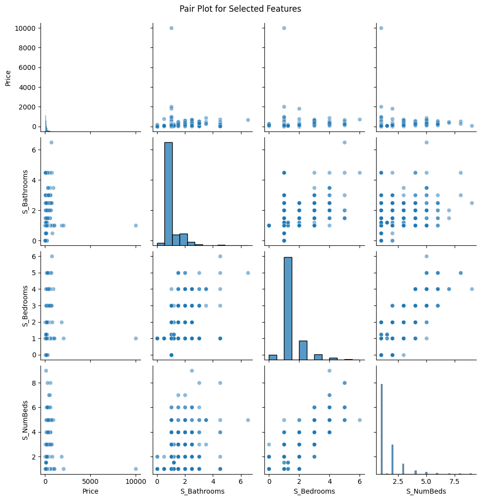

# Aim
The primary aim of this project is to develop a machine learning model to accurately predict the price of properties, specifically for Airbnb listings. By utilizing a range of property features such as the number of bedrooms, bathrooms, cleaning fees, and derived metrics, this model helps property owners estimate appropriate listing prices and provides insights into market trends.

# Problem Statement
Pricing a property on platforms like Airbnb involves several challenges, including:

- **Uncertainty in Market Trends:** Property owners often struggle to set competitive prices without deep market knowledge.
  
- **Complex Dependencies:** Property price depends on multiple factors, including location, amenities, and property size, making manual predictions unreliable.
  
- **Risk of Revenue Loss:** Incorrect pricing can result in either loss of potential bookings or underutilization of profit margins.
  
This project addresses these challenges by creating a predictive solution that ensures fair pricing while helping property owners optimize their revenue.

# Methodology
 - Data Collection
 - Data Cleaning
 - Feature Engineering
 - Model Training
   - Price predicton: **Random Forest Regressor**
   - Hyperparameter tuning: **GridSearchCV** 
 - Model Evaluation
   - **Mean Squared Error (MSE)** and **R² Score** are used to assess performance.
 - Prediction
  
# Tech Stack
## Languages & Libraries
- **Programming Language:** Python
- **Libraries:**
   - **Data Analysis:** pandas, numpy
   - **Machine Learning:** scikit-learn
   - **Visualization:** matplotlib
   - **Model Persistence:** joblib
## Tools
- **Jupyter Notebook:** For exploratory data analysis
- **GitHub:** For version control and collaboration

# Results
Feature importances

Pair Plot for Selected Features

# License
This project is licensed under the MIT License.
You are free to use, modify, and distribute this software for both personal and commercial purposes, provided the original source is credited.
